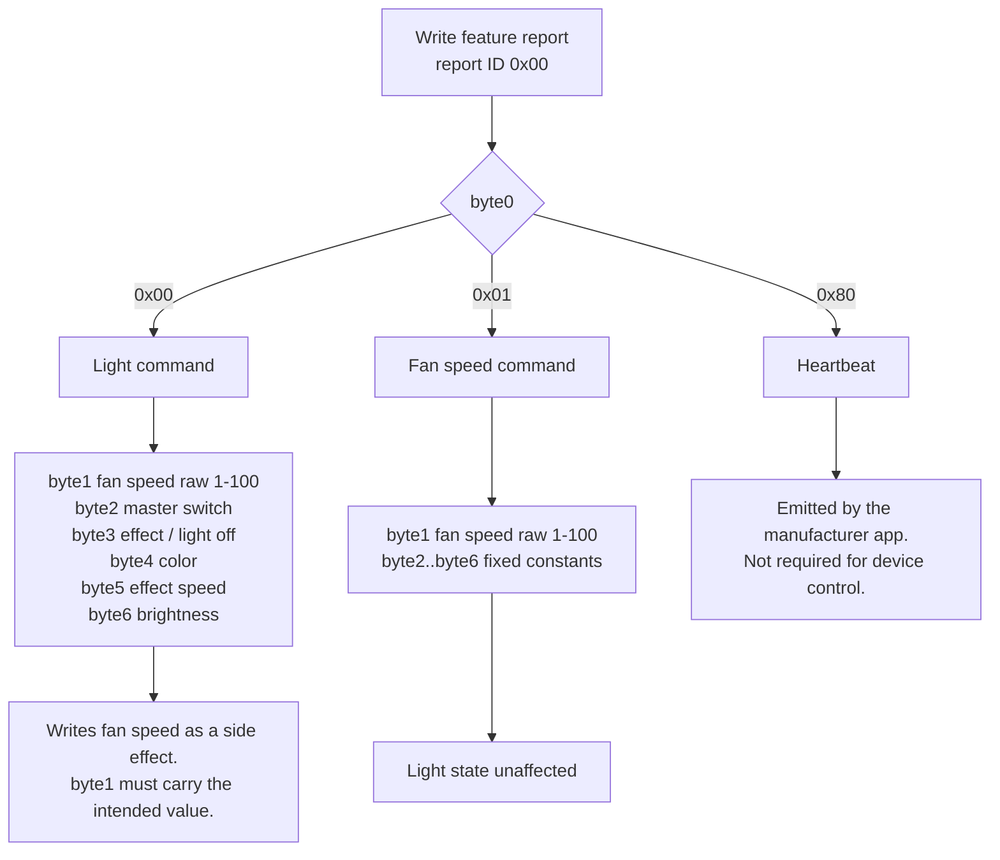
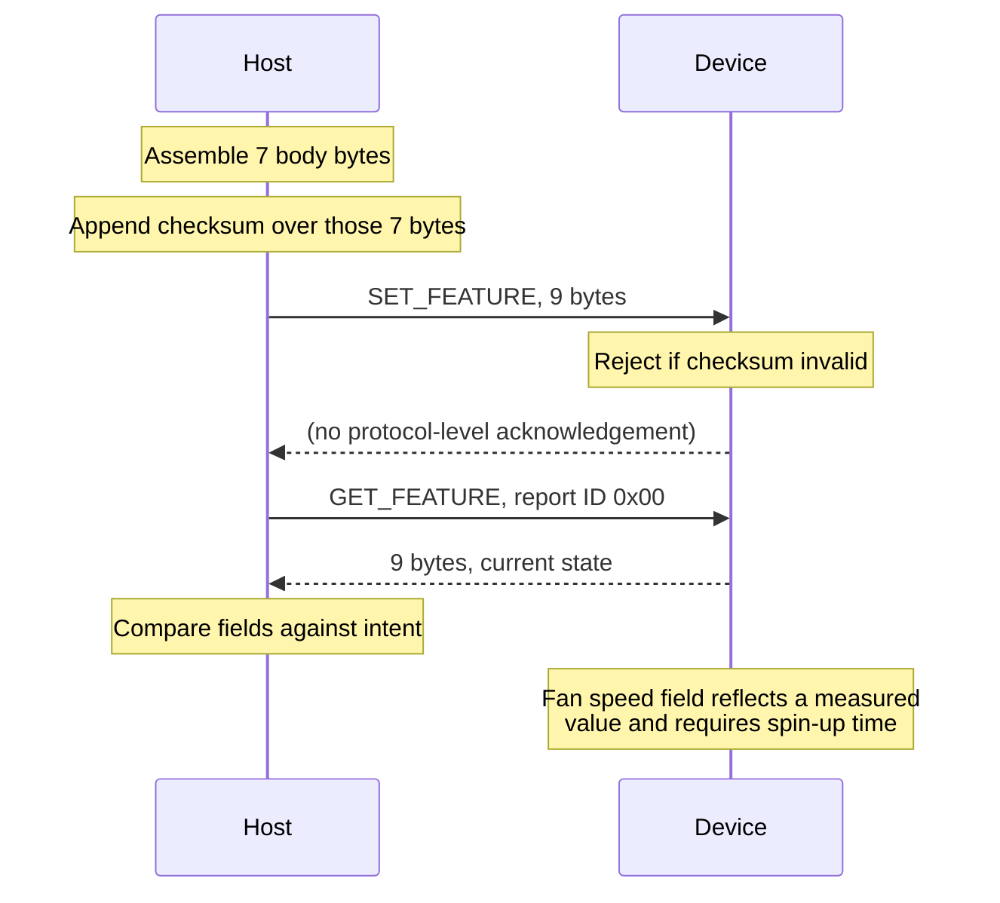

# llano V12 Ultra: USB-HID protocol reference

Technical reference for the USB-HID protocol of the llano V12 Ultra RGB laptop cooling pad.

This document is **reference material**: it states what the device does, not how to accomplish a
particular task. For installation and usage of this project's tools see [README.md](README.md).
For the reverse-engineering history and the reasoning behind these findings see
[HISTORY.md](HISTORY.md).

Scope: everything needed to control the device from an independent implementation in any language.

> This project is not affiliated with, endorsed by, or authorized by the manufacturer of the llano
> brand or the Myth.Cool software. See the trademark notice in [README.md](README.md).

## Conventions

| Term | Meaning |
|---|---|
| `byteN` | Byte *N* of the 7-byte report **body**, counted from 0. Body `byteN` is at buffer offset `N+1`. |
| Buffer offset | Index into the 9-byte buffer that is passed to the transport, including the leading report ID. |
| raw | The device's internal fan speed scale, 1 to 100. Not RPM. |
| Verified | Measured against physical hardware. See [Verification status](#verification-status). |

All numeric values are hexadecimal when prefixed `0x`, decimal otherwise. All multi-byte values:
there are none, every field is a single byte.

## Contents

- [Device identification](#device-identification)
- [Report inventory](#report-inventory)
- [Feature report frame](#feature-report-frame)
- [Checksum](#checksum)
- [Command selection](#command-selection)
- [Command 0x00: light](#command-0x00-light)
- [Command 0x01: fan speed](#command-0x01-fan-speed)
- [Read layout](#read-layout)
- [Value ranges](#value-ranges)
- [Transport: Linux](#transport-linux)
- [Transport: Windows](#transport-windows)
- [Transaction sequence](#transaction-sequence)
- [Usage examples](#usage-examples)
- [Device behavior](#device-behavior)
- [Unsupported operations](#unsupported-operations)
- [Verification status](#verification-status)

## Device identification

| Property | Value |
|---|---|
| Vendor ID | `0x374A` |
| Product ID | `0xB101` |
| Controller | Holtek |
| Device class | USB HID |
| Driver required | None |

## Report inventory

The HID report descriptor declares exactly three reports. There are no further report IDs.

| Report | Body size | Direction | Function |
|---|---|---|---|
| Feature | 8 bytes | bidirectional | All control and all telemetry |
| Input | 64 bytes | device to host | None known. See [Unsupported operations](#unsupported-operations). |
| Output | 64 bytes | host to device | None known. See [Unsupported operations](#unsupported-operations). |

All device control and all state retrieval use the feature report. The input and output reports
carry no known function.

## Feature report frame

The transport prepends the report ID, so implementations operate on a 9-byte buffer.

| Buffer offset | Name | Covered by checksum | Value |
|---|---|---|---|
| 0 | Report ID | No | `0x00` |
| 1 | `byte0` | Yes | Command selector |
| 2 | `byte1` | Yes | Command-dependent |
| 3 | `byte2` | Yes | Command-dependent |
| 4 | `byte3` | Yes | Command-dependent |
| 5 | `byte4` | Yes | Command-dependent |
| 6 | `byte5` | Yes | Command-dependent |
| 7 | `byte6` | Yes | Command-dependent |
| 8 | Checksum | No | See [Checksum](#checksum) |

The checksum covers body bytes 0 through 6. It never covers the report ID or itself.

## Checksum

```
checksum = (0xFF - (byte0 + byte1 + byte2 + byte3 + byte4 + byte5 + byte6)) & 0xFF
```

The device rejects reports carrying an incorrect checksum. Reports read from the device carry a
valid checksum.

## Command selection

`byte0` selects the command. The remaining body bytes are interpreted according to that selection.



A fan speed command never changes light state. **A light command does change fan speed**: `byte1`
is the fan speed field in both commands. Implementations that issue a light command must supply
the intended fan speed in `byte1`, normally the current value read beforehand. See
[Fan speed in the light command](#fan-speed-in-the-light-command).

## Command 0x00: light

| Body byte | Buffer offset | Field | Accepted values |
|---|---|---|---|
| `byte0` | 1 | Command selector | `0x00` |
| `byte1` | 2 | **Fan speed.** See [Fan speed in the light command](#fan-speed-in-the-light-command). | `0x01`-`0x64` |
| `byte2` | 3 | Master switch | `0x00` = on, non-zero = off |
| `byte3` | 4 | Effect, or light off | `0x00`-`0x04`, or `>= 0x80` |
| `byte4` | 5 | Color | `0x00`-`0x04` |
| `byte5` | 6 | Effect speed | `0x00`-`0x03` |
| `byte6` | 7 | Brightness | `0x00`-`0xFF` |

### Colors (`byte4`)

| Value | Name |
|---|---|
| 0 | red |
| 1 | lightblue |
| 2 | green |
| 3 | purple |
| 4 | orange |

Names follow the manufacturer application. Each value is accepted and echoed back by the device.

### Effects (`byte3`)

| Value | Effect |
|---|---|
| 0 | solid |
| 1 | breathing |
| 2 | rainbow |
| 3 | chase |
| 4 | zones |
| `>= 0x80` | Light off |

`zones` is a fixed preset pattern. Individual LEDs are not addressable.

### Effect speed (`byte5`)

`0` is fastest, `3` is slowest. The manufacturer application emits only 0 through 3. Values above
3 are accepted but do not vary monotonically.

### Fan speed in the light command

`byte1` of the light command is the same field that command `0x01` writes and that a read returns
at offset 2. The device adopts the value written there.

| Value in `byte1` | Effect on fan speed |
|---|---|
| `0x00` | Fan speed is set to 0 |
| `0x01`-`0x64` | Fan speed is set to that value |

This applies to every light command, including a command that only changes color. An
implementation that leaves `byte1` at 0 therefore stops the fan on every color change.

Correct usage: read the feature report, take offset 2, and write it back in `byte1` unless a new
fan speed is intended.

Command `0x01` remains the dedicated way to change fan speed without touching light state.

### Switch-off semantics

Two independent mechanisms exist. They differ in what they stop.

| Mechanism | Field | Light | Fan |
|---|---|---|---|
| Light off | `byte3 >= 0x80` | Off | Runs |
| Master off | `byte2 != 0` | Off | Stops |

The master switch has no intermediate levels. Every non-zero value behaves identically.

## Command 0x01: fan speed

| Body byte | Buffer offset | Field | Value |
|---|---|---|---|
| `byte0` | 1 | Command selector | `0x01` |
| `byte1` | 2 | Fan speed | `0x01`-`0x64` (1 to 100) |
| `byte2` | 3 | Fixed | `0x00` |
| `byte3` | 4 | Fixed | `0x00` |
| `byte4` | 5 | Subcommand tag | `0x02` |
| `byte5` | 6 | Fixed | `0x00` |
| `byte6` | 7 | Fixed | `0xFF` |

`byte1` is the only variable field.

### Speed scale

| raw | RPM |
|---|---|
| 1 | 300 |
| 48 | 1500 |
| 100 | 2800 |

The scale is approximately linear at roughly 25 RPM per raw step. Every raw value in 1 to 100
produces a distinct speed.

The device's own display rounds to 100 RPM steps and can be reproduced as:

```
level = round((raw - 1) * 25 / 99)
rpm   = 300 + level * 100
```

This formula reproduces the rounded display value, not the true rotational speed.

## Read layout

A feature report read returns current device state. The field layout differs from the write
layout: offset 2 carries fan speed rather than a command argument.

| Buffer offset | Field | Notes |
|---|---|---|
| 0 | Report ID | `0x00` |
| 1 | `byte0` | |
| 2 | Fan speed | raw scale 1 to 100. Measured value, see [Device behavior](#device-behavior). |
| 3 | Master switch | `0x00` = unit on |
| 4 | Effect | `< 0x80` indicates light on |
| 5 | Color | |
| 6 | Effect speed | |
| 7 | Brightness | |
| 8 | Checksum | |

A single read returns fan speed, master state, light state, color, effect, effect speed and
brightness. State set through the physical wheel is reflected here as well.

## Value ranges

| Field | Accepted by device | Documented range | Behavior outside the documented range |
|---|---|---|---|
| Fan speed | 0-255 | 1-100 | Accepted and echoed. Rotational speed does not increase beyond the maximum. The display extrapolates without bound and shows 6675 RPM at raw 255. |
| Color | 0-255 | 0-4 | Undocumented |
| Effect | 0-255 | 0-4, `>= 0x80` | Values 5 to `0x7F` undocumented |
| Effect speed | 0-255 | 0-3 | Accepted, not monotonic |
| Brightness | 0-255 | 0-255 | 0 is not visually distinguishable from off |

Implementations must clamp fan speed to 1 through 100. The device does not enforce this range.

## Transport: Linux

Access path: `/dev/hidraw*`, raw ioctls. No library dependency.

| Operation | ioctl | Direction bits | Type | Number |
|---|---|---|---|---|
| Read feature report | `HIDIOCGFEATURE` | 3 | `H` | `0x07` |
| Write feature report | `HIDIOCSFEATURE` | 3 | `H` | `0x06` |

ioctl number encoding:

```
number = (direction << 30) | (ord(type) << 8) | nr | (size << 16)
```

Both operations use direction `3` (`_IOC_READ | _IOC_WRITE`) and size 9.

### Device node discovery

The matching node is found through sysfs by vendor and product ID:

```
/sys/class/hidraw/hidraw*/device/uevent
```

The file contains the vendor and product ID in uppercase hexadecimal. The node name is the fourth
path component.

### Permissions

Unprivileged access requires a udev rule.

```
SUBSYSTEM=="usb", ATTR{idVendor}=="374a", ATTR{idProduct}=="b101", MODE="0660", GROUP="plugdev", TAG+="uaccess"
KERNEL=="hidraw*", ATTRS{idVendor}=="374a", ATTRS{idProduct}=="b101", MODE="0660", GROUP="plugdev", TAG+="uaccess"
```

Reference copy: [`packaging/70-llano-v12ultra-ctrl.rules`](packaging/70-llano-v12ultra-ctrl.rules).
The rule requires the accessing user to be a member of `plugdev`. Rules take effect after
`udevadm control --reload-rules` and `udevadm trigger`.

### hidapi on Linux

hidapi is not suitable for this device on Linux. `hid.device().open()` triggers a full USB rebind
on every call, reproduced in 5 of 5 cycles. Raw hidraw ioctls do not exhibit this behavior.

## Transport: Windows

Access path: hidapi. There is no hidraw equivalent.

| Requirement | Detail |
|---|---|
| Python binding | `hid` (PyPI), the official libusb/hidapi binding |
| Native library | `hidapi.dll` must be present in the DLL search path. It is **not** contained in the PyPI package. Official builds: [github.com/libusb/hidapi/releases](https://github.com/libusb/hidapi/releases) |
| API shape | `hid.Device(vid=, pid=)`, `.read(size, timeout=<ms>)` |
| Argument type | `send_feature_report` requires `bytes`, not `list` |

An older cython-hidapi release exposes `hid.device()`, `.open()` and `timeout_ms=` instead. Code
written against that API fails against the binding named above.

The USB rebind behavior observed on Linux does not occur on Windows.

## Transaction sequence

Writes are not acknowledged at the protocol level. State is confirmed by reading the feature
report back.



## Usage examples

The examples are byte-equivalent to the reference implementation in
[`protocol.py`](src/llano_v12ultra_ctrl/protocol.py) and carry no dependency on this project.

### Report construction, both platforms

```python
def checksum(body7):
    return (0xFF - sum(body7)) & 0xFF

def build_fan_report(raw):
    assert 1 <= raw <= 100
    body7 = [0x01, raw, 0x00, 0x00, 0x02, 0x00, 0xFF]
    return bytes([0x00] + body7 + [checksum(body7)])

def build_light_report(color, fan_raw, effect=0, speed=0, brightness=0xFF,
                       light_on=True, power=True):
    """fan_raw: the fan speed to apply. Pass the value currently reported at
    offset 2 to leave the fan unchanged. Passing 0 stops the fan."""
    body7 = [
        0x00,                                # command selector
        fan_raw,                             # fan speed, see the note above
        0x00 if power else 0x01,             # master switch
        0x80 if not light_on else effect,    # effect, or light off
        color,
        speed,
        brightness,
    ]
    return bytes([0x00] + body7 + [checksum(body7)])
```

### Linux

```python
import ctypes, fcntl, glob, os

def find_hidraw():
    for uevent in glob.glob("/sys/class/hidraw/hidraw*/device/uevent"):
        with open(uevent) as f:
            content = f.read().upper()
        if "374A" in content and "B101" in content:
            return "/dev/" + uevent.split("/")[4]
    return None

def _ioc(direction, typ, nr, size):
    return (direction << 30) | (ord(typ) << 8) | nr | (size << 16)

HIDIOCSFEATURE = _ioc(3, "H", 0x06, 9)
HIDIOCGFEATURE = _ioc(3, "H", 0x07, 9)

fd = os.open(find_hidraw(), os.O_RDWR)

def read_state(fd):
    buf = ctypes.create_string_buffer(9)
    buf[0] = b"\x00"
    fcntl.ioctl(fd, HIDIOCGFEATURE, buf, True)
    return buf.raw

# Write: fan speed 50
fcntl.ioctl(fd, HIDIOCSFEATURE, ctypes.create_string_buffer(build_fan_report(50), 9), True)

# Write: solid green, carrying the current fan speed so the fan keeps running
current_fan = read_state(fd)[2]
light = build_light_report(color=2, fan_raw=current_fan)
fcntl.ioctl(fd, HIDIOCSFEATURE, ctypes.create_string_buffer(light, 9), True)

# Read: current state
raw = read_state(fd)

os.close(fd)
```

Field extraction from `raw`:

| Expression | Field |
|---|---|
| `raw[2]` | Fan speed, raw scale |
| `raw[3] == 0x00` | Unit on |
| `raw[4] < 0x80` | Light on |
| `raw[4]` | Effect |
| `raw[5]` | Color |
| `raw[6]` | Effect speed |
| `raw[7]` | Brightness |

### Windows

```python
import hid

dev = hid.Device(vid=0x374A, pid=0xB101)
dev.send_feature_report(build_fan_report(50))

current_fan = bytes(dev.get_feature_report(0x00, 9))[2]
dev.send_feature_report(build_light_report(color=2, fan_raw=current_fan))

raw = bytes(dev.get_feature_report(0x00, 9))
```

Report construction and field extraction are identical to Linux. Only the transport differs.

## Device behavior

Properties that affect implementations, stated as measured.

| Property | Detail |
|---|---|
| Offset 2 is stable | At a constant setting, 400 consecutive reads returned the identical value with no deviation, as did 1190 reads spanning 0 to 6 seconds after a write. Readings of `0` that are not explained by a light command carrying `byte1 = 0` were not observed once a concurrent writer was excluded. |
| Concurrent writers corrupt measurements | Any second process issuing light commands changes fan speed through `byte1`. Measurements require exclusive access. |
| The motor needs time to reach a new speed | Mechanical spin-up and spin-down are not instantaneous. Offset 2 changes immediately; the audible speed follows. |
| The physical wheel remains active | The wheel is a parallel input and is not disabled by software control. Its position is reflected in the telemetry field. |
| A light command writes fan speed | `byte1` is the fan speed field. A light command that leaves it at 0 stops the fan. See [Fan speed in the light command](#fan-speed-in-the-light-command). |
| Writes are not acknowledged | Confirmation requires a read-back. See [Transaction sequence](#transaction-sequence). |
| Disconnection surfaces as an I/O error | On Linux the ioctl raises `OSError` with `errno 19` (`ENODEV`). A device can disappear between two calls within the same operation, so both reads and writes require error handling. |

Consumers that derive a displayed RPM from offset 2 inherit the transient behavior above. A single
low reading shortly after a change does not indicate a fault.

## Unsupported operations

Tested and found not to work. Listed so implementations do not depend on them.

| Operation | Result |
|---|---|
| Additional report IDs | The report descriptor was read in full and declares exactly three reports. |
| Control through the 64-byte output report | All 64 byte positions were tested individually across the value range, along with all-zero and all-`0xFF` patterns. Writes produce a brief visible flicker and no persistent, controllable effect. |
| Decoding the 64-byte input report | No content-dependent meaning identified. Observable through `llano-v12ultra-ctrl raw-input`. |
| Writing arbitrary content to the display | No command identified. The display shows only its own derived speed value, including the unbounded extrapolation above raw 100. |
| Addressing individual LEDs | Effect 4 (`zones`) is a fixed preset. No per-LED interface exists. |

## Verification status

| Area | Status | Method |
|---|---|---|
| Colors 0-4 | Verified | Each value written and read back on hardware, 2026-08-12 |
| Effects 0-4 | Verified | Each value written and read back on hardware, 2026-08-12 |
| Effect speed 0-3 | Verified | Each value written and read back on hardware, 2026-08-12 |
| Brightness 0, 64, 128, 255 | Verified | Written and read back on hardware, 2026-08-12 |
| Light off leaves fan running | Verified | `byte3 = 0x80`, read-back confirmed light off and unit on, 2026-08-12 |
| Master switch stops the unit | Verified | `byte2 = 0x01`, read-back confirmed, 2026-08-12 |
| Fan speed scale reference points | Verified | raw 1, 48 and 100 against the device display |
| Fan speed, all 100 raw values | Verified | Each value applied individually and confirmed audibly and on the display |
| `byte1` of the light command sets fan speed | Verified | Fan set to 20/80/50 via command `0x01`, then a light command carrying `byte1` = 80/20/100. The reported speed followed `byte1` in every case, 2026-08-12 |
| A light command with `byte1 = 0` stops the fan | Verified | Fan set to 50, then six consecutive light commands with `byte1 = 0`. Reported speed fell to 0 and stayed there, 2026-08-12 |
| Fan telemetry stability | Verified | 400 consecutive steady-state reads, 1190 reads across post-write intervals, 2026-08-12 |
| Report descriptor contents | Verified | Descriptor read from sysfs |
| Windows transport | Verified | `status`, `light` and `fan-speed` against hardware on Windows 10 |
| Color names | Follows the manufacturer application | Names not independently confirmed against a colorimeter |

Colors are named as the manufacturer application names them. The device confirms every value
numerically; the names describe the manufacturer's labelling, not a measured wavelength.

## Reporting corrections

Measurements that contradict this document are welcome, particularly from other llano V12
variants. Include the hardware revision, the exact bytes written, and the bytes read back. See
[Contributing](README.md#contributing).
